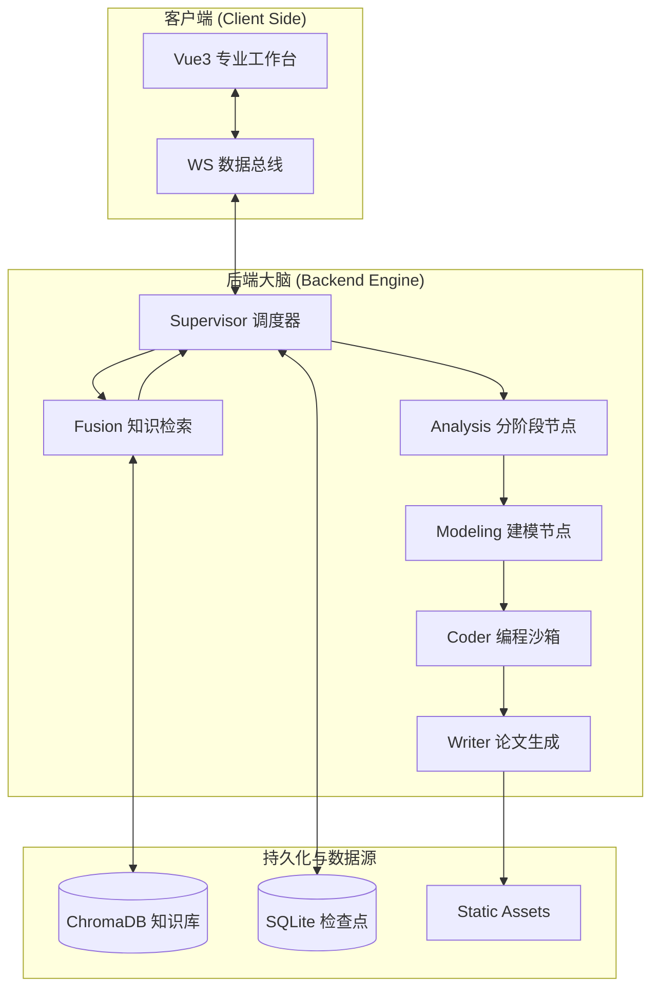

# 🏛️ MCM/ICM Multi-Modal RAG Agent
### O 奖级数学建模全自动专家系统

[](https://github.com/google/generative-ai)
[](https://langchain.com)

基于 **LangGraph** 与 **Gemini 2.5 Flash** 深度定制的数学建模竞赛 (MCM/ICM) 辅助生成智能体。系统集成了多模态解析、动态路由调度、学术知识融合以及具备自愈能力的编程沙箱，旨在为复杂建模任务提供端到端的自动化解决方案。

---

## 🔥 核心引擎能力 (Engine Capabilities)

- **智能意图分发 (Supervisor Logic)**：系统大脑能根据用户意图，自动在“即席咨询”、“单阶段任务”与“全链路流水线任务”之间进行路由切换。
- **双轨知识融合检索 (Knowledge Fusion)**：
    - **本地 RAG**：深度检索历年 O 奖论文向量库，提取高价值学术方法论。
    - **Web Grounding**：实时调用 Google Search 补充物理世界最新数据，解决数据时效性痛点。
- **原子级状态一致性 (Reliability)**：底层采用有状态图（Stateful Graph）设计，支持 Checkpointer 恢复，确保在复杂逻辑分支下状态不丢失。
- **任务内重置 (In-task Restart)**：支持在同一任务下“一键重新开始”，清空任务消息与图状态检查点，避免历史状态污染新一轮推理。
- **纯结构化协议 (Structured-First Contract)**：
    - 后端节点产物、WS 事件、历史消息回放统一输出 `ContentBlock[]` + `stage`。
    - 前端采用块级渲染组件，不再依赖单一字符串/`v-html` 渲染主链路。
- **模型空输出自愈 (Modeler Self-Healing)**：
    - 对 `Modeling` 节点新增空输出重试与模型降级兜底（同模型重试 -> 2.5 Flash Lite 回退）。
    - 增强原始响应诊断日志（finish_reason、candidate_count、block_reason 等）便于定位。
- **受控依赖安装 (Controlled Auto-Install)**：
    - Coder 沙箱可在白名单内自动安装缺失库并重跑一次（`numpy/pandas/matplotlib/seaborn/scikit-learn/scipy/pulp`）。
    - 默认提示词引导优先使用 `numpy/pandas`，减少 `scipy` 依赖导致的执行失败。
- **多角色专家矩阵**：
    - **Prompt Engineer**: 负责全局任务拆解与指令优化。
    - **Modeler Node**: 产出规范的数学描述与符号体系。
    - **Coder Node**: Python 数据工程与图表生成，具备自动 Debug 闭环。
    - **Reviewer Node**: 逻辑校验与论文对齐审计。

---

## 🏗️ 系统架构拓扑 (System Topology)



---

## 🚀 快速启动指南 (Getting Started)

### 1. 环境准备
确保您的开发环境已安装 **Python 3.11+** 和 **Node.js 18+**。

### 2. 后端部署
```bash
# 复制项目并安装依赖
poetry install

# 配置环境变量 (创建 .env 文件)
GOOGLE_API_KEY="您的 Gemini API 密钥"
```

启动后端服务：
```bash
poetry run python -m backend.main
```

### 3. 前端启动
```bash
cd frontend
npm install
npm run dev
```

---

## 📝 核心业务流程 (Workflow)

1.  **赛题读取 (Read)**：通过 Gemini Vision 能力解析包含图表的 PDF/图片赛题。
2.  **知识注入 (Retrieve)**：检索历史 O 奖建模思路并调研实时客观数据。
3.  **审题分析 (Analyze)**：挖掘隐含约束，建立全局一致的符号表。
4.  **数学推导 (Model)**：生成 Latex 格式的核心公式与模型描述。
5.  **仿真验证 (Code)**：生成并执行 Python 代码，产出 Seaborn 图表。
6.  **论文撰写 (Write)**：整合前序所有成果，产出高水平学术论文草稿。

---

## 📡 结构化通信说明（关键变更）

- WS `FINAL`：`payload.blocks + payload.stage`
- WS `INTERMEDIATE`：`summary_blocks + preview_blocks + stage + ask_continue`
- WS `PROGRESS/STATUS/ERROR`：统一结构化 `payload.blocks`
- 历史消息接口：返回 `content_blocks`（并保留 `content_text` 便于调试）

详见：`docs/api_contract.md`

---

## 📂 资源导出说明

- **全量产出包**: `backend/static/exports/final_submission.zip`
- **论文草稿**: `thesis.md` & `thesis.tex`
- **数据图表**: `backend/static/plots/`

---
*Powered by Antigravity Digital Orchestration. 2026.*
