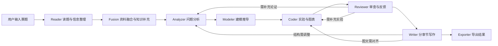

# Mathematical Modeling Agent

这是一个面向数学建模竞赛的人机协作系统。  
它的目标是辅助用户把论文流程做得更完整、更清晰：从读题、分析、建模、实验到写作和导出，提供持续支持与迭代建议。

相比更偏“通用建模问题求解”的同类项目，我们更聚焦竞赛论文场景，强调过程辅助、反复打磨和按竞赛要求完成高质量提交。

## 1. 核心功能（通俗版）

### 1.1 一次输入，走完整个论文流程
- 用户提交题目后，系统会给出清晰的阶段流程，减少来回切换工具的成本。
- 每一步都会返回当前进度和阶段结果，方便用户随时介入、调整方向。
- 最终沉淀为可继续修改的论文草稿和配套材料，而不是零散片段。

### 1.2 会“参考优秀论文”，也会“补充新信息”
- 系统会参考高质量建模论文中的常见写法，辅助用户形成更规范的竞赛表达。
- 对需要新数据的题目，会补充外部信息，帮助用户减少信息过时带来的偏差。

### 1.3 不只写文字，还会给图和结果
- 系统会协助生成并整理图表、结果说明和导出文件。
- 论文正文会尽量与图表对应，帮助用户减少“有图但文中没解释”的问题。

### 1.4 支持同一任务重开，避免历史干扰
- 如果当前方向不理想，可以在同一任务里重新开始。
- 重开后不会被上一轮中间状态干扰，更适合多轮试错和迭代优化。

### 1.5 面向交付而不是演示
- 关注点是“辅助用户完成竞赛论文交付”，而不是只做能力演示。
- 在流程稳定性、可追踪性和可复用性上做了较多工程化处理，便于实际使用。

## 2. 节点流转与循环流程图



## 3. 技术架构与选型

### 3.1 技术栈
- 前端：Vue 3 + Vite + Pinia + Naive UI
- 后端：FastAPI + LangGraph + LangChain
- 大模型：Gemini 系列
- 存储：
  - SQLite（用户、任务、消息、执行状态）
  - ChromaDB（本地 RAG 检索）

### 3.2 选型理由
- **FastAPI**：适合 HTTP + WebSocket 双通道，接口开发和调试效率高。
- **LangGraph**：适合多阶段、有状态、可恢复的流程编排。
- **SQLite + ChromaDB**：本地部署成本低，适合竞赛研发与快速迭代。
- **Vue3 + Pinia**：适合阶段进度和结构化内容的前端状态管理。

### 3.3 工程实现要点
- 全链路采用结构化内容协议（`ContentBlock[] + stage`），降低渲染和回放歧义。
- 支持任务内重启、日志追踪、数据库兼容迁移和回滚方案。
- 沙箱支持白名单依赖自动安装与失败重试，提高实验步骤可执行率。

## 4. 模型路线与后续模式

- 当前主模型路线：**Gemini**。
- 后续将新增一个模式：基于 **Gemini Deep Research** 的研究型写作流程。
  - 目标是进一步提升论文写作的工程成熟度和稳定性。
  - 重点增强资料整合、论证链路一致性、章节级可控生成能力。

## 5. 快速启动

### 5.1 环境要求
- Python 3.11+
- Node.js 18+

### 5.2 后端
```bash
poetry install
poetry run python -m backend.main
```

### 5.3 前端
```bash
cd frontend
npm install
npm run dev
```

## 6. 协议与文档

- API/WS 契约：`docs/api_contract.md`

## 7. 说明

- 运行时大文件（数据库、日志、导出图表）默认不纳入版本控制。
- 数据库迁移脚本位于 `backend/db/migrations/`，包含执行入口与回滚说明。
