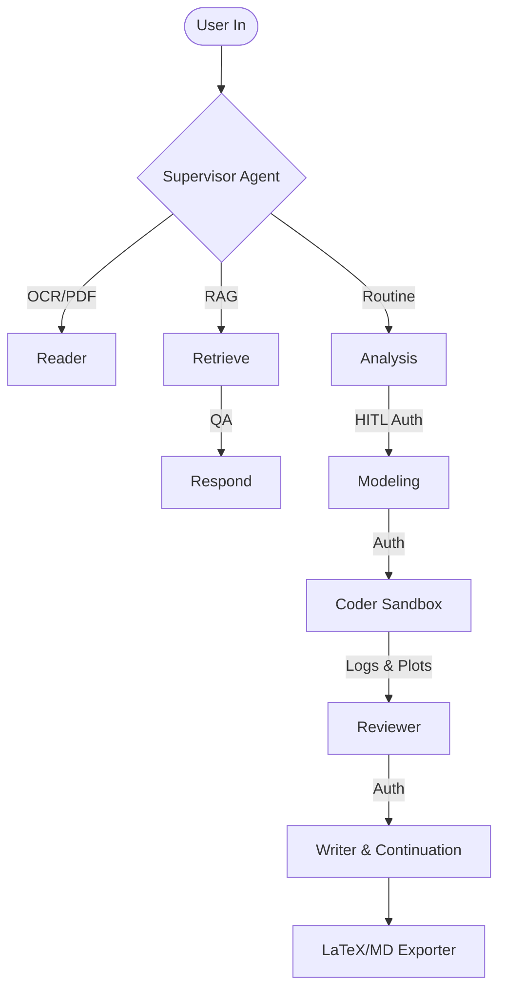

# MCM/ICM Multi-Modal RAG Agent (O 奖级数学建模智能体)

基于 LangGraph 与 Gemini 2.5 Flash 打造的生产级多模态 RAG 数学建模竞赛 (MCM/ICM) 辅助生成智能体。
本项目实现了从赛题解析、数学建模、代码仿真测试、图表生成到最终 LaTeX/Markdown 论文撰写的全栈端到端自动化，并配备了人机协同 (Human-in-the-Loop) 的实时审批工作流。

## ✨ 核心特性 (Key Features)

*   **智能意图路由 (Supervisor V2)**: 根据用户输入，动态决定最佳处理链路（直接查询回复、独立生成代码还是开启全量大流水线）。
*   **多模态增强检索 (MM-RAG)**: 突破传统纯文本限制。通过 ChromaDB，系统不仅能检索文本，更能理解和引用带有复杂 LaTeX 公式和趋势分析走势图表的历年 O 奖优秀论文。
*   **全链路动态推理 (Multi-Tenant Config)**: 支持多租户多任务并发。核心图节点运行时，动态从 SQLite 数据库提取并实例化专属的 API Key 与模型配置，彻底解决硬编码和脏上下文问题。
*   **安全沙箱自治调试 (Self-Debugging Sandbox)**: Coder 节点生成的仿真代码会被置于受限子进程执行。发生崩溃或错误时，Agent 自动捕获 Traceback 堆栈并尝试最多三次内在修复，确保产出物 100% 可行。
*   **并发安全消息总线 (WebSocket Pub/Sub)**: 后端采用订阅者模式的双向长连接。即使遇到阻塞流或海量 Token 流水，每个前端用户均可获取隔离且有序的步骤播报与进度监听。
*   **版权防护盾 (Copyright Shielding)**: 在全局提示词中施加硬控输出约束，严格阻断 AI 主动透传或泄露 RAG 库中素材的具体年份、队号与奖项标识，充分保护隐私与数字合规底线。

## 🏗 系统架构 (Architecture)



核心专家节点集群：
1.  **Reader**: 复杂文档视觉分析引擎（集成 Gemini Vision 取代传统 OCR 方案拯救公式乱码）。
2.  **Analyzer**: 负责挖掘隐性条件，提出核心模型假设与核心变量映射体系。
3.  **Modeler**: 建立目标函数约束方程与主微分方程 (ODEs) 等强推理数学架构。
4.  **Coder**: 基于 Pandas、SciPy 发起数据清洗与计算仿真，完成 Seaborn 图表落地封装。
5.  **Reviewer**: 利用沙箱执行日志（Error Rate/Loss数值）和渲染的图片双重核对逻辑合理性，具有强反馈纠偏机制。
6.  **Writer**: 防截断续写护卫盾，高度对标历届 O 奖学术摘要、格式要求与遣词造句习惯。

## 🛠 技术栈 (Tech Stack)

*   **Agentic Framework**: `langgraph`
*   **LLM Engine**: `langchain-google-genai` (默认挂载: `gemini-2.5-flash`)
*   **Backend API Gateway**: `fastapi`, `uvicorn`, `websockets`
*   **Vector Datastore**: `chromadb`
*   **Persistence Tracking**: `langgraph-checkpoint-sqlite` (单会话无感断点续存), `sqlalchemy` (用户及任务映射)
*   **Environment & Deps**: `poetry`

## 🚀 快速启动 (Quick Start)

### 1. 依赖安装
本项目使用 `poetry` 管理核心环境，建议准备好 Python 3.11+ 的环境底座。
```bash
poetry install
```

### 2. 环境变量配置
在项目根目录创建 `.env` 配置文件。尽管目前实现了数据库层级的动态挂载，但建议仍保留备选项用作异常接管（可选）：
```ini
GOOGLE_API_KEY="AIzaSyXXXXXXXXXXXXXXXX"
```

### 3. RAG 知识库与资产挂载
将切分与嵌入完成的 ChromaDB 目录（`chroma_db`）及关联参考图源（`RAG_Chunks_Gemini`）置入特定的子目录树 `rag_service/` 内：
```text
/rag_service
  ├── chroma_db/
  └── RAG_Chunks_Gemini/ 
```

### 4. 点燃服务
```bash
poetry run python -m backend.main
```
FastAPI 服务将部署于本地 `http://localhost:8000/`；而全速的 WebSocket 总线接口架设在 `ws://localhost:8000/ws/chat/{client_id}`。

## 📚 资产交互出口路由
*   **静态图片/图表库**: `/plots/{filename}`
*   **全结构论文压缩体**: `/exports/{filename}`
*   **HTTP 会话网关**: `/api/v1/chat`

---
*Automated Delivery Report | Powered by Antigravity*
